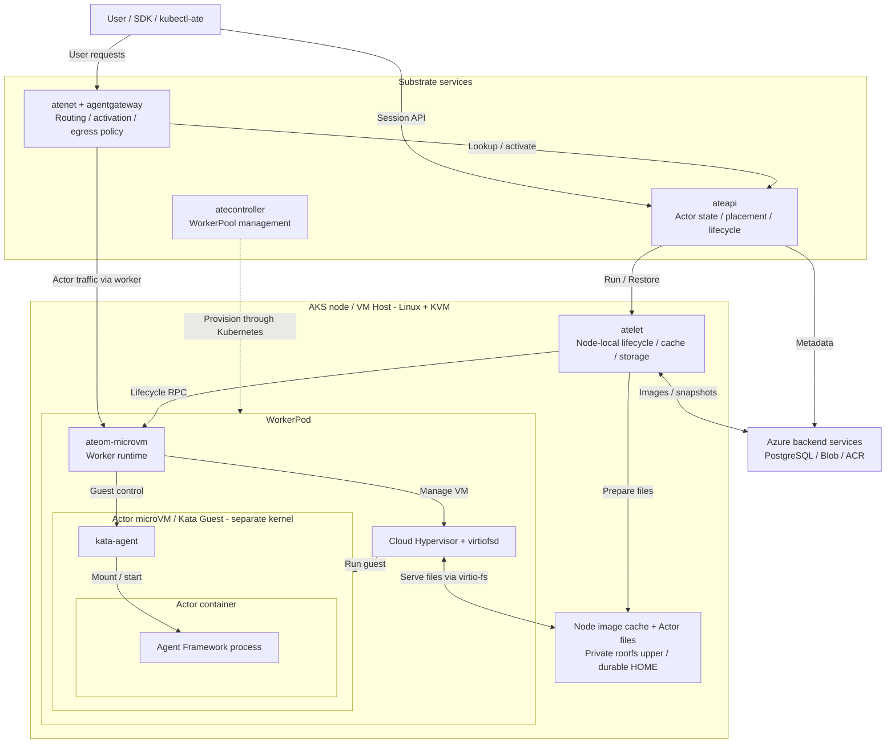

# Azure HOME Data Verification

Updated: 2026-10-06. Subscription: `edd0c578-a7c3-4a61-9536-63273eb9bc9b`.
Resource group: `menxiao-substrate-1005`.

## Component And Actor Topology

Current Azure microVM cold HOME/Data deployment. One representative AKS node,
WorkerPod and running Actor are shown. The diagram emphasizes component roles
and containment; control-plane Pod placement and individual network hops are
omitted. Dashed edges represent worker provisioning.



The nested boxes show VM Host -> WorkerPod -> microVM/Guest -> Actor container.
The VMM and file server are host processes; kata-agent and the application run
inside the guest. The drawing shows one Actor assignment, not a permanent
one-Actor-per-worker restriction. Actor UID/session is not a Pod identity.

Actor traffic passes through an isolated host netns/TAP and guest virtio-net;
atunnel supplies ingress/egress transport. These hops, DNS and certificate
projection are omitted for readability. `podcertcontroller` and Entra Workload
Identity preserve native mTLS and scoped Azure access. The Kata system disk
uses virtio-blk; application files and HOME currently use virtio-fs. Cold Data
Suspend persists HOME only, and Resume starts a new user process with the same
Actor UUID. Prebooted VM pools and application block disks remain proposals.

## Native E2E Result (2026-10-06)

**The AKS 1.37.0 native cold HOME/Data lifecycle now passes.** Both
`ClusterTrustBundle` and `PodCertificateRequest` are served as v1. Substrate
was deployed with build `azure-data-20261006`, its original signer/mTLS, the
existing passwordless Azure PostgreSQL and private Blob endpoint. All four
control-plane Deployments are Ready, atelet is 3/3 Ready, and three microVM
workers are distributed one per node. No new node pool was required.

The `data-agent` template has no golden tag. Its native authenticated
`PreloadImage` calls reported all three desired nodes cached and Ready.
Runtime assets were uploaded and read back with the four pinned SHA-256 values
under `actor-state/runtime/amd64/<sha256>/<filename>`.

| Native check | Evidence |
| --- | --- |
| Actual Agent Requests | Seven non-streaming queries and one streaming query through native CONNECT ingress and the OpenAI SDK; exact prior-five output excluding current. |
| Same-node Data resume | Session `08e6de2e-0f28-47cb-b325-9b5830ba920e` retained; boot changed from `eda332a6-3d55-4201-91ff-d40614161153` to `dee6eda3-7717-4045-ab79-246038d9a89f`. |
| Cross-node Data resume | Native DrainWorker forced node 0 to node 2; same session/history, fresh boot `852124f5-2366-455a-b1cb-555814d527c8`. |
| Remote snapshot inspection | Actual Actor snapshot contained only `manifest.json` and `durable-dir.tar.zstd`; manifest scope Data, one HOME volume and eight historical queries. No VM memory or rootfs-upper objects. |
| Actor isolation | `native-b` had a distinct UUID and independent query history before and after A's migration. |
| Recreated same-name Actor | `native-c` UUID changed from `4875f760-2887-4c93-b27d-db3efbde5037` to `d3d32e6b-7887-49cd-9177-60c98d2372fc`; first response had no previous queries. |
| Rootfs exclusion | A marker written into A's private host-backed rootfs upper disappeared on Data cold resume; HOME history remained. |
| Local cache | Native atelet logs recorded Data snapshot cache hits; all five sampled same-node restores hit local Data cache. OCI image and runtime asset caches were prewarmed. |
| Upload fail closed | A separate unauthorized-container template produced Blob 403, CRASHED rather than SUSPENDED, and no committed externalSnapshot. No grant was widened. |

The final suspended A snapshot
`622edda0-96af-48fc-bc26-d215747cf10d` was inspected again after all functional
checks and contained eleven HOME query records with the same tar/manifest-only
object set. This snapshot, normal suspended Actors and the native deployment
are retained for continuation.

### AKS Workload Identity Compatibility

The installed WI mutating webhook dropped the new v1 `podCertificate` fields:
the controller template contained the projection, while the admitted Pod
contained `{}`. For native ateapi/atelet, the Azure dev overlay therefore uses
explicit, kubelet-rotated one-hour ServiceAccount tokens with audience
`api://AzureADTokenExchange`, read-only token mounts and the same WI SDK/client
IDs. Its WI webhook label is false to avoid lossy mutation. Federation, native
PodCertificate issuance, mTLS and role scopes are unchanged. No static tokens,
keys, SAS, unverified TLS, certificate emulation or authentication bypass were
introduced. Other component Pods use their original native certificates.

Azure overlays also remove GCP `PodMonitoring` and GKE credential-provider host
mounts. The pinned existing agentgateway image was mirrored into the approved
ACR rather than changing image admission policy. The overlay is deliberately
opt-in and specific to this dev resource group, not a general Azure installer.

### Native Timing Samples

Five samples on a warm same-node cache, tiny HOME history, one vCPU Actor:

| Phase | p50 | p95 (nearest rank, five samples) |
| --- | --- | --- |
| atelet Data checkpoint including remote persistence | 83.7 ms | 90.5 ms |
| atelet cold Data restore through   | 5.627 s | 5.655 s |

The first observed cross-node restore took 5.460 s at atelet: Blob manifest
5.93 ms, artifact download 6.18 ms, cached OCI preparation 0.79 ms, and runtime
restore 5.447 s. An earlier same-node cache hit took 5.245 s. The five benchmark
restores had local manifest access 0.078-0.117 ms, local artifact work
0.187-0.607 ms and OCI preparation 0.541-1.105 ms. User Python process/readiness
dominates; this is not a sub-500 ms activation result.

CLI wall-clock Resume was 9.19-9.28 s and Suspend 3.70-4.23 s, including a fresh
CLI authentication/port-forward per invocation. Do not confuse these with
runtime latency. Five observations are a smoke benchmark, not a production
tail-latency SLO. Live local-cache corruption repair was not fault-injected;
corruption and budget behavior remain covered by unit tests.

### Applied Mtime Fix And Cache Rebuild (2026-10-06)

The confirmed unpacker defect is now fixed and deployed. After writing and
closing a regular file, `unpackLayer` restores the tar header's modification
time through `os.Root.Chtimes`; path confinement is unchanged. The regression
failed before the fix and passes afterward, covering Unix epoch, nanoseconds,
replacement entries and hardlinks. Full imagecache and atelet package race
tests, scoped Go vet/lint, and formatting checks passed.

The default atelet cache root is now `/var/lib/ate/image-cache-v2`, with the
same layout version `1`. This forces clean extraction without repairing or
deleting shared old layers. Explicit `--image-cache-dir` deployments must
select a fresh root too. See the [cache migration procedure](../../internal/imagecache/README.md#cache-generation-migration).

Only atelet was rebuilt, published and rolled out. Its pinned image is:

```text
menxiaosubstrate1005.azurecr.io/substrate/atelet:azure-data-mtime-20261006@sha256:7571a7eb6ddda0bf2d18a148fe074b6046211aa4dbfb956270032f85d79469f8
```

The existing `atelet-azure-data-20261006` DaemonSet temporarily used OnDelete:
node 1 was replaced and validated first, then nodes 0 and 2 one at a time.
All three replacements are Ready. RollingUpdate/maxUnavailable=1/maxSurge=0
was restored. Native certificates, explicit Workload Identity, node selectors,
worker resources, runtime assets and every other component image were kept.
Do not overwrite this atelet pin with the original `azure-data-20261006`
atelet image when reapplying the baseline installer configuration.

The controller prewarmed the original application digest into the new cache
on all three nodes. A disposable fixed-node WorkerPool was moved through
nodes 1/0/2; each actual microVM reported 2,984 valid `.pyc`, zero mtime or
size mismatches, and overlay layer paths exclusively under the new root.
No per-start timestamp repair, compileall, tmpfs copy or dependency change was
used. Both old and new trees occupy about 214 MiB per node. The old
`/var/lib/ate/image-cache` is retained: stale overlay specs remain from an
earlier failed diagnostic, and shared-layer/reference cleanup is not bypassed.
Do not delete it while any running/paused workload or retained Full snapshot
may still reference its absolute paths.

An independent native Actor, UID `acd4172a-3ab2-4264-b5ad-88f26894a5a6`,
used the unchanged original application image
`sha256:b584c4fc70b73ae25dd2d084ecf94a8e1b3cb6703dfadda971d010f02bbc1e7a`
on node 2, with one vCPU/512 MiB and one host CPU/1 GiB. Its entrypoint had
no instrumentation or bytecode scan. Five cold Data restores all hit the local
Data snapshot cache. A seed Responses request before the cycles and another
afterward verified exact prior history; session stayed fixed and boot UUID
changed on every restore. Normal Actors/histories were not used for this test.

| Cycle | atelet total Restore | Runtime Restore | Native readiness gate |
| --- | --- | --- | --- |
| 1 | 3.432894 s | 3.430723 s | 3.107409 s |
| 2 | 3.368231 s | 3.366745 s | 3.056667 s |
| 3 | 3.424226 s | 3.420398 s | 3.096031 s |
| 4 | 3.401086 s | 3.399736 s | 3.094158 s |
| 5 | 3.362421 s | 3.360872 s | 3.041582 s |
| p50 | **3.401086 s** | | **3.094158 s** |
| p95, nearest rank | **3.432894 s** | | **3.107409 s** |

The total p50 is 39.6% below the earlier 5.626985 s five-sample baseline.
These are comparable warm-cache, tiny-HOME smoke samples on separate test
Actors/times, not a paired production SLO experiment. They are atelet
`Restore timing breakdown` values, not CLI authentication/port-forward time
or the earlier diagnostic process-spawn measurements. Trace
`a72f99db30f1cf5461e43922936680be` is the representative total-p50 sample.

Temporary verification Actors/templates, WorkerPool and CONNECT port-forward
were removed after validation. Original `native-a`/`native-b`/`native-c`
session UUIDs, snapshot URIs and SUSPENDED states remain unchanged; their
WorkerPool and application image were not modified. The unrelated denied
upload Actor remains in its previously reported DELETING state. No Azure
infrastructure resource or authorization grant was added.

### Same-Image Entrypoint To Listening A/B (2026-10-06)

This comparison measures only user-application startup, not CreateActor,
Pod scheduling, registry pulls, VM boot, snapshot work or request transport.
Five alternating pairs ran on `aks-system-40703928-vmss000002`: ordinary Pod
first, then a fresh Actor/guest. Each application was stopped before the next
environment started. Worker and template creation and all-node image preload
completed before sampling. Both environments used this identical image:

```text
menxiaosubstrate1005.azurecr.io/data-agent@sha256:14c22963c817b104da877a73d213773a3e6dc273f6306597c8ce7d313b06cb71
```

The image retains the pinned Python base, locked MAF/Responses dependencies
and the same actual Agent application, adding opt-in boundary markers only.
The normal template's original image was not replaced. Both samples used the
same entrypoint wrapper and `AGENT_STARTUP_PROFILE=1`:

```sh
export AGENT_ENTRYPOINT_START_NS=$(date +%s%N)
exec python /app/app.py 2>/tmp/entrypoint-profile.log
```

**Start** is the local timestamp immediately before `exec python`; wrapper
and timestamp-command initialization before that anchor are excluded. The
first interval includes shell handoff, Python ELF/interpreter startup and
loading the application until its first module timer. **End** is the
`server_listening` marker emitted only after Uvicorn's `startup()` returns
with `server.started` true, after ASGI startup and socket creation. Real
`/readyz` 200 was also verified in every sample. Kubelet's one-second probe
interval and the Actor's wakeup-probe timing do not define this endpoint.
No remote wall-clock alignment is needed for the measured interval: both
anchors are inside the same container/guest. It is not a timestamp of the
kernel exec instruction itself. Phase timers use local monotonic clocks;
the pre-exec anchor uses local wall time, so clock adjustments would affect
that enclosing interval. Marker overhead remains included.

Both application declarations were one CPU/512 MiB; Pod and WorkerPool CPU
requests were 250m. The Actor worker retained one host CPU/1 GiB and used
virtio-fs rootfs over `image-cache-v2`; the ordinary Pod used containerd's
host overlayfs. The Actor receives fresh, mtime-preserved dependency layers.
Guest and host kernels/effective memory remain different: guest kernel
6.18.35 and its existing RAM reserve, versus host kernel 6.8.0-1067-azure and
the Pod's 512-MiB memory cgroup. The warm-node caches do not make a newly
booted guest's page cache warm. This compares complete execution environments,
not an experiment varying only the filesystem protocol.

| Entrypoint to listening | Ordinary Pod | Actor / virtio-fs |
| --- | --- | --- |
| p50, five new processes per environment | **1,201.606 ms** | **3,032.455 ms** |
| p95, nearest rank | **1,208.404 ms** | **3,090.655 ms** |
| Pair 1 | 1,208.367 ms | 2,987.200 ms |
| Pair 2 | 1,201.606 ms | 3,032.455 ms |
| Pair 3 | 1,208.404 ms | 2,966.706 ms |
| Pair 4 | 1,195.283 ms | 3,044.520 ms |
| Pair 5 | 1,192.086 ms | 3,090.655 ms |

The difference between total medians is **1,830.848 ms**, or **2.524x** total
startup time. Paired differences range from 1,758.302 to 1,898.569 ms. This is
a five-pair smoke comparison, not a production tail-latency SLO.

| Startup interval, containment shown by `>` | Pod p50 | Actor p50 | Actor minus Pod phase medians |
| --- | --- | --- | --- |
| Entrypoint to server listening | **1,201.606 ms** | **3,032.455 ms** | **1,830.848 ms** |
| > Pre-exec handoff/interpreter/application-loader boundary | 17.177 ms | 92.612 ms | 75.434 ms |
| > Application module entry to server listening | 1,184.152 ms | 2,945.347 ms | 1,761.195 ms |
| > > Standard-library imports and marker setup | 299.503 ms | 558.498 ms | 258.995 ms |
| > > Requested MAF core symbols/dependencies | 203.756 ms | 543.693 ms | 339.937 ms |
| > > Responses adapter/OpenAI dependencies | 428.533 ms | 1,216.283 ms | 787.750 ms |
| > > FastAPI imports | 144.543 ms | 334.342 ms | 189.799 ms |
| > > Module definitions | 0.092 ms | 0.259 ms | 0.167 ms |
| > > Uvicorn import | 68.384 ms | 149.986 ms | 81.602 ms |
| > > HistoryClient/session validation construction | 0.123 ms | 0.298 ms | 0.175 ms |
| > > MAF Agent construction | 3.052 ms | 5.395 ms | 2.344 ms |
| > > FastAPI instance construction | 0.299 ms | 0.613 ms | 0.314 ms |
| > > Route registration | 17.344 ms | 42.196 ms | 24.852 ms |
| > > Uvicorn run entry marker | 0.048 ms | 0.168 ms | 0.121 ms |
| > > Server config/event-loop/ASGI setup through lifespan | 12.397 ms | 57.206 ms | 44.809 ms |
| > > Lifespan to completed server startup/listening | 0.304 ms | 0.897 ms | 0.593 ms |

Each column reports independent phase medians: parent rows contain their
children, but neither child medians nor their differences should be added
to reconstruct a median sample. For example, Pair 2 is additive separately:
Pod 17.454 ms bootstrap + 1,184.152 ms module = 1,201.606 ms;
Actor 87.108 ms bootstrap + 2,945.347 ms module = 3,032.455 ms.

The five import intervals together, summed within each individual sample,
had medians 1,146.460 ms for Pod and 2,830.269 ms for Actor. In each matched
pair, the import-interval difference accounted for 90.7-92.5% of that pair's
total startup difference. These are full import intervals including file
lookups/reads, bytecode loading/execution and model/schema work, not pure file
I/O timers. Responses/OpenAI and MAF imports were about 2.84x and 2.67x,
respectively, in their phase medians. Actual Agent construction itself was
only about 3.1 versus 5.4 ms.

| Module window accounting | Pod p50 | Actor p50 |
| --- | --- | --- |
| Wall time through listening | 1,184.152 ms | 2,945.347 ms |
| Process CPU in instrumented window | 1,182.336 ms | 2,178.930 ms |
| Per-sample wall-minus-process-CPU remainder | 1.936 ms | 770.228 ms |

The remainder is not a disk-I/O counter: it can include FUSE waits, scheduling
and quota/virtualization effects. Process CPU includes guest kernel work and
does not separately account for host virtiofsd/VMM. Pod cgroup observations
showed zero throttling in four samples and 1,363 us in the fifth. The
diagnostic worker accumulated 638,045 us over the whole five-Actor workflow,
including VM boot and other untimed lifecycle work; it is not a measured
entrypoint-only throttle duration and cannot be subtracted from startup.
All sampled memory max/OOM counters were zero. Increasing guest memory,
changing host CPU budget or cache policy was not part of this comparison.

The existing reopen/held-FD and corrected-bytecode/tmpfs experiments support
virtio-fs access overhead as an important contributor. This new comparison
confirms the gap remains for the same bytecode-correct image without including
VM boot, but cannot attribute all 1.831 s to virtio-fs independently of guest
execution, kernel and shared CPU effects. There was no importtime tracing,
pre-start bytecode scan, per-process compileall or tmpfs dependency copy.

Generated raw samples and phase summaries are in
`/tmp/substrate-entrypoint-ab.json` and
`/tmp/substrate-entrypoint-ab-summary.json`. Fourteen focused Agent/profiling
tests passed, and a local real-image check verified an HTTP 200 after the
listening marker. Temporary Pods, Actors/template and WorkerPool were removed
after sampling; original Actor identities/history/snapshots, normal image and
the deployed mtime-fixed atelet remain unchanged.

### Warm-Cache Create To First Reply (2026-10-06)

Five fresh sessions (`lifecycle-2` through `lifecycle-6`) were measured on
node `aks-system-40703928-vmss000002`, one vCPU/512 MiB Actor and one host
CPU/1 GiB worker, after the mtime fix. Worker, template, CONNECT port-forward,
client SDK construction and all-node image prewarm completed before timing.
The diagnostic image is
`menxiaosubstrate1005.azurecr.io/data-agent@sha256:f4f833a61b3ef0a3d49be1dfac14027fa8edf9095b539c5358ede51b53f1b1b5`.
It uses the same base, locked dependencies and real official Agent/Responses
adapter, with opt-in stage logging. It is not the normal template's image.
Cache is warm, but each guest, interpreter, Agent and HOME are new.

CreateActor records the UUID/session in PostgreSQL and returns SUSPENDED.
It does not launch Python. Immediately afterward, the first real Responses
request goes through native CONNECT, triggers ResumeActor/atelet Run, waits
for readiness, then reaches the Agent. Each reply was checked for the exact
new session UUID, query text and empty previous history. A calibration session
and an incomplete CreateActor attempt were excluded from the five samples.

The requested boundary is represented by completion of the kata-agent
container create/start RPC batch (`Agent setup phases`). OCI environment,
including `FOUNDRY_SESSION_ID`, is delivered during that batch. The actual
exec instruction was not independently timestamped and occurs within the
23.4-28.0 ms container batch. Thus the client two-stage split below is
approximate: it combines client/node wall clocks without offset calibration.
Exact local intervals use monotonic clocks or native RPC duration fields.

| Overall interval | p50 | p95, nearest rank (n=5) |
| --- | --- | --- |
| Client CreateActor invocation to complete first reply | **7,928.581 ms** | **9,358.180 ms** |
| > Client CreateActor CLI invocation | 3,687.086 ms | 4,893.063 ms |
| > First request submitted to complete SDK response | 4,260.100 ms | 4,465.117 ms |

The same total can alternatively be split at container-start completion:

| Launch-boundary view (alternative, not additional steps) | p50 | p95 |
| --- | --- | --- |
| Client CreateActor invocation to complete first reply | **7,928.581 ms** | **9,358.180 ms** |
| > Approximate stage A: client create invocation to container-start completion | 4,619.885 ms | 5,836.143 ms |
| > Approximate stage B: container-start completion to client complete reply | 3,334.606 ms | 3,522.083 ms |

Each `>` indicates one containment level below the preceding parent. It is
not an execution-order marker. Group rows without timings only organize
children; they introduce no additional measured duration. The two views
above overlap and must not be added together.

Independent medians are not an additive ledger. Client wall-clock differences
and monotonic totals also differed by up to about 21 ms, so do not assign
sub-millisecond precision to the cross-machine split. The 3.69 s CLI creation
is not database/session creation latency: the measured server CreateActor
RPC was only 4.21-6.22 ms. CLI bootstrap, Kubernetes auth/port-forward, network
and process overhead are included in the former and were not individually
profiled. A persistent SDK's client-side creation latency was not measured.

#### Stage A: Before User Process Initialization

| Observable preparation interval | p50 | p95 |
| --- | --- | --- |
| Server CreateActor: validation, template lookup, UUID/session persistence | 5.421 ms | 6.218 ms |
| atelet Run excluding its readiness wait, combined envelope | 317.083 ms | 333.479 ms |
| > Residual Run work outside post-BootVM timing | 66.562 ms | 67.460 ms |
| > Hybrid-vsock socket wait | Approximately 0.02 ms | |
| > Guest boot to kata-agent connection | 219.377 ms | 231.084 ms |
| > Post-boot kata-agent setup (group) | | |
| > > Kata sandbox/virtio-fs mount setup | 5.468 ms | 5.741 ms |
| > > Guest network configuration | 3.781 ms | 4.951 ms |
| > > OCI container create + environment handoff + process start | 24.470 ms | 28.023 ms |

The 317 ms envelope contains the detailed native startup intervals beneath it
and is not another additive step. The 67 ms residual includes atelet's cached
OCI/bundle preparation, cached runtime assets, HOME setup, host egress/rootfs
preparation, virtiofsd/VMM/tap setup and small RPC/post-readiness bookkeeping.
These preparations can run in parallel. Current fresh-Run logs do not isolate
each one, so the residual must not be described as a measured OCI unpack or
disk-download time. There is no prior Data snapshot to download for a brand
new Actor. UUID generation and environment-list construction likewise have
no separate timer; they are included in their enclosing operations.

The activation control RPC took 3.434-3.504 s, including the nested atelet Run
and readiness. Its difference from atelet Run was 25.2-36.0 ms for worker
selection/assignment, API state work and transport on both sides of Run.
Certificate minting was another nested observation, about 1.1-1.9 ms, not
an extra additive stage. Neither control-RPC duration can be added to Run.

#### Stage B: Initialize, Handle First Request, Return Reply

| User-process initialization interval | p50 | p95 |
| --- | --- | --- |
| Native readiness gate after container-start completion | **3,125.790 ms** | **3,153.005 ms** |
| > Instrumented module entry to first readiness handler | **3,016.926 ms** | **3,036.062 ms** |
| > > Standard-library imports and marker setup | 582.564 ms | 594.480 ms |
| > > Requested MAF core symbols/dependencies | 546.218 ms | 606.281 ms |
| > > Responses adapter/OpenAI dependencies | 1,246.653 ms | 1,309.143 ms |
| > > FastAPI imports | 342.609 ms | 369.802 ms |
| > > Uvicorn import | 137.376 ms | 155.578 ms |
| > > HistoryClient/session validation construction | 0.250 ms | 0.478 ms |
| > > MAF Agent construction | 5.203 ms | 6.647 ms |
| > > FastAPI instance construction | 0.660 ms | 0.839 ms |
| > > Route registration | 60.933 ms | 64.675 ms |
| > > Uvicorn run entry to ASGI lifespan | 38.669 ms | 40.637 ms |
| > > Lifespan to first readiness handler | 5.174 ms | 22.703 ms |
| > Interpreter/bootstrap plus RPC/probe boundary remainder | 112.067 ms | 116.943 ms |

The readiness gate contains the instrumented module window and its boundary
remainder; the import/construction steps are children of the module window,
not additional peers of it. Small definitions/run-entry steps total under 1 ms
per sample. The bootstrap remainder is not an isolated Python loader timer;
it also includes the differing container RPC and probe boundaries.

| First non-streaming Responses handler interval | p50 | p95 |
| --- | --- | --- |
| Handler entry to encoded response, total | **106.755 ms** | **122.548 ms** |
| > Responses parsing, validation and response-ID construction | 0.534 ms | 1.396 ms |
| > MAF call through result return (group) | | |
| > > MAF dispatch and entry into history worker thread | 11.503 ms | 22.346 ms |
| > > HOME mkdir + history file open | 2.244 ms | 7.745 ms |
| > > Exclusive file lock | 0.723 ms | 0.819 ms |
| > > Read existing history (empty on first query) | 0.322 ms | 0.676 ms |
| > > Append current query + flush | 0.669 ms | 0.975 ms |
| > > fsync before answering | 6.703 ms | 7.775 ms |
| > > File close, answer finalization and MAF result return | 0.826 ms | 1.922 ms |
| > Responses conversion/model construction + JSON encoding | 85.304 ms | 86.889 ms |

The last row includes first-use adapter/model work, not just JSON byte
serialization. FastAPI request-body parsing happens before handler entry and
is not separately timed. There is no remote LLM call in this deterministic
HistoryClient. Stage durations include preceding diagnostic-marker writes;
file-lock/fsync numbers should not be treated as syscall-only timings.

Guest wall-clock anchors additionally show readiness handler to Responses
handler entry at p50 24.283 ms (p95 26.415 ms), and encoded response to client
complete reply at approximately 114.546 ms (p95 242.216 ms). The latter is an
uncalibrated cross-machine estimate including ASGI send, router/CONNECT,
network, body reception and SDK decoding, not isolated network latency.
An exact monotonic residual of first-request latency minus atelet Run minus
the handler window was p50 730.002 ms (p95 866.469 ms): this lumps client
request setup, ingress/activation routing and return transport on both sides
of the process boundary, so it cannot all be charged to stage A or stage B.

The client-total-median sample is `lifecycle-3`, UID
`784c9bc4-e65a-46ca-a2e3-d76f973f2ad5`. Its exact client ledger is
3,690.438 ms CreateActor CLI + 4,238.143 ms first request = 7,928.581 ms.
Its first-request ledger is 3,401.386 ms atelet Run + 106.755 ms handler +
730.002 ms outside those windows = 4,238.143 ms. Nested in Run are
3,084.321 ms readiness and 317.065 ms remaining work. This is an additive
single sample; the tables above instead report independent phase quantiles.

Raw generated observations are in `/tmp/substrate-lifecycle-final.json` and
`/tmp/substrate-lifecycle-server-events.json` on the development host. They
are transient diagnostic artifacts, not a durable benchmark dataset. Thirteen
Agent/profiling tests passed. Temporary sessions/template/worker and CONNECT
forwarding were cleaned afterward; original Actors, snapshots, normal image,
one-CPU resource settings and the deployed mtime-fixed atelet stayed unchanged.

### Agent Readiness Startup Profile

An isolated profiling image was published at
`menxiaosubstrate1005.azurecr.io/data-agent@sha256:a716e77d12b2a524fb50d1546481ff9e10fa9494da2482b1d78b5f87424dc88d`.
The normal template's original digest was not changed. Startup markers are
opt-in with `AGENT_STARTUP_PROFILE=1`; `profile-start.sh` additionally enables
Python `-X importtime` and redirects stderr to non-durable
`/tmp/agent-startup-profile.log`. Retrieve that file through the trusted worker
at `/var/lib/ate/actors/<uid>/rootfs-upper/agent/fs/tmp/agent-startup-profile.log`
before suspend. `analyze-startup.py` reads it from stdin, or summarizes raw log
files passed as arguments. Its exclusive import accounting has a unit test.

Three importtime starts (one initial activation, two Data restores) reported
1,088 import records in the first sample. Readiness gates were
5.275/4.954/5.249 s. Three marker-only starts on nodes 1/0/2 gave
5.073/4.777/4.855 s. These are new diagnostic runs, not an exact decomposition
or replacement of the earlier five-sample 5.294 s representative gate.
Importtime can perturb small-file I/O; the runs were not paired on a fixed
node, so their median difference is not a calibrated profiler overhead.

The marker-only gate-median observation on node 2 is additive below. Trace:
`8339a3193939352dc98d985d9af7dde2`, time `2026-10-06T04:36:12.005373385Z`,
diagnostic Actor UID `171fe642-47fc-457d-babf-724182f645a7`.

| Exclusive startup interval | Wall time | Guest process CPU time |
| --- | --- | --- |
| Standard-library imports and marker setup | 612.759 ms | 521.918 ms |
| Requested MAF core symbols and dependencies | 1,019.075 ms | 810.219 ms |
| Official Responses adapter and dependencies | 2,043.201 ms | 1,387.942 ms |
| FastAPI imports | 524.927 ms | 437.583 ms |
| Uvicorn import | 257.590 ms | 227.124 ms |
| MAF Agent construction | 55.436 ms | 53.830 ms |
| Route registration | 157.851 ms | 137.535 ms |
| Other definitions, HistoryClient/FastAPI construction, run entry | 1.417 ms | 1.239 ms |
| Uvicorn run entry to ASGI lifespan | 80.832 ms | 45.283 ms |
| ASGI lifespan to first readiness handler | 4.454 ms | 3.093 ms |
| Unsegmented gate boundaries | 97.388 ms | Not measured |
| Full native readiness gate | 4,854.929 ms | 3,625.365 ms within instrumented process window |

Import groups occupy 4,457.552 ms, or 91.8% of this gate. The instrumented
module-entry-to-handler window is 4,757.541 ms; its non-process-CPU remainder
is 1,132.176 ms. That remainder is not a disk-I/O measurement: it can include
filesystem waits, quota/scheduler waits and virtualization effects. The
97.388 ms boundary remainder includes interpreter/bootstrap work before the
first marker and probe completion after the handler; these are not separately
measured. Individual phase medians must not be added to reconstruct a sample.

The import tree identifies `agent_framework_hosting_responses._parsing` as
loading `openai.types.responses`; the OpenAI subtree takes 1.83-2.01 s with
importtime and includes eval/graders types not used by this demo. These nested
cumulative values overlap and must not be summed. This is local type/model
loading, not a remote model call. MAF core already exposes lazy public exports;
requesting Agent/BaseChatClient still loads their actual dependency modules.

A single ordinary Pod on node 1, same immutable image, one CPU/512 MiB,
completed ASGI startup at 1,302.852 ms (Responses import 463.026 ms, MAF import
256.139 ms). Its first readiness request came 594 ms later because Kubernetes
probed at one-second intervals; this is not Substrate's one-millisecond poll.
The image already contains 2,984 site-packages `.pyc` files, and Pod cgroup
`nr_throttled`/`throttled_usec` were zero. The ordinary Pod is only a diagnostic
control; it does not isolate guest CPU execution, filesystem overhead and host
scheduling from one another or establish microVM throttling counters.

The initial phase-only evidence suggested narrower SDK imports and filesystem
profiling. The controlled experiments below supersede that optimization order:
the image contains bytecode, but its validity depends on source timestamps.
Do not return readiness before the actual Agent is initialized, or move this
work into the first response and call it an end-to-end improvement. No storage
architecture, runtime isolation or cold Data semantics changed.

The two profiling Actors/templates and ordinary control Pod were removed after
measurement. The profiling image and opt-in instrumentation remain available;
normal Actors/histories were not modified. All nine Agent/analyzer tests pass.

### Controlled microVM Loading A/B (2026-10-06)

**Confirmed defect: the custom OCI layer unpacker discards regular-file mtime,
invalidating every timestamp-based Python bytecode cache in this image.**
This and virtio-fs file-lifecycle overhead are independently measurable. Shared
host CPU quota contributes, but doubling it does not eliminate the gap.

All AKS comparisons used node `aks-system-40703928-vmss000001` and the same
immutable profiling image above. An isolated `loading-ab` WorkerPool copied
the normal worker's limits (one host CPU, 1 GiB) and requests (250m, 1 GiB),
and selected only that node. Actors retained one vCPU/512 MiB declarations;
ordinary Pods used one CPU/512 MiB. The startup Pod requested one CPU; the
compute and bytecode-control Pods requested 250m to match worker CPU weight.
The guest reported `MemTotal: 361268 kB` after runtime/kernel reserves, whereas
the ordinary Pod's memory cgroup limit was 512 MiB. These are equal declared
Actor/Pod limits, not identical effective memory or kernel configurations.
Host kernel was 6.8.0-1067-azure; guest kernel was 6.18.35. No OOM/max-memory
events or host memory PSI were observed in the diagnostic worker.

`loading-ab.py` runs fresh copies of the actual `/app/app.py` on port 8081,
requests its real `/readyz` immediately after Uvicorn reports listening, and
captures the existing startup markers. Every table's startup measurement is
process-spawn-to-successful-local-readiness, excluding subsequent termination
and all setup interventions. It is not CLI Resume, VM boot or the supervisor's
port-8080 completion gate. Each case has three observations; repeated starts
share one guest except the separate one-/two-host-CPU boots. Ordinary Pods ran
after diagnostic VMs were suspended. The original Actors stayed suspended.

#### Host CPU And File Operations

| Same-image control | Agent startup median | Samples |
| --- | --- | --- |
| Ordinary Pod, one CPU | 1.220 s | 1.255 / 1.220 / 1.218 s |
| microVM, one vCPU / one host CPU | 4.680 s | 4.942 / 4.680 / 4.672 s |
| Same Actor, one vCPU / two host CPUs | 4.199 s | 4.199 / 4.089 / 4.240 s |

The diagnostic Pod was resized through Kubernetes' `resize` subresource; no
manual cgroup mutation, original-worker change or extra vCPU was involved.
Its observed `cpu.max` changed from `100000 100000` to `200000 100000`.
Across each complete baseline workflow, host `throttled_usec` increased
1,795,870 us at one CPU and zero at two CPUs. The 10.3% startup improvement
supports CPU headroom as a contributor. That whole-workflow throttle counter
cannot be subtracted from any individual startup. Guest steal-time deltas
also decreased, but steal, host PSI and throttling are not additive measures.
No guest cgroup mount was exposed, so guest `cpu.max` was not measured.

The matched file set was the first 2,000 sorted `.pyc` paths under
`/usr/local/lib/python3.12`: exactly 14,959,902 bytes, copied into existing
64-MiB `/dev/shm` for the tmpfs control. Three reads of each fixed set:

| File workload | Guest virtio-fs | Guest tmpfs | Ordinary Pod rootfs |
| --- | --- | --- | --- |
| Open, read all, close: initial workflow median | 1,250.946 ms | 23.307 ms | 30.210 ms |
| Open, read all, close: split-operation workflow median | 1,268.012 ms | 23.081 ms | Not repeated |
| Open/close only, no data read: split workflow median | 999.610 ms | 10.894 ms | Not repeated |
| Held-FD read, first aggregate pass | 255.733 ms | 4.270 ms | Not repeated |
| Held-FD read, second aggregate pass | 9.889 ms | 3.161 ms | Not repeated |
| Held-FD read, third aggregate pass | 3.388 ms | 2.396 ms | Not repeated |

Held-FD reads aggregate 128-file batches, with descriptor setup/close excluded;
they are not a throughput benchmark including all setup. All passes still
read the same 2,000 files and byte count. An earlier attempt held all 2,000
FDs, failed against the guest's 1,024 limit and timed out readiness. That run
was excluded; bounded batches passed locally under a stricter 256-FD limit
and then in the guest. Full reopen/read/close remained slow across passes,
but repeated reads with descriptors held became fast. Hot `stat` can also be
fast (6.2-6.7 ms in the first guest workflow), so neither bulk bandwidth nor
directory lookup alone explains the result.

The runtime starts virtiofsd with `--cache=auto --thread-pool-size=1` in
[overlay_linux.go](../../cmd/ateom-microvm/internal/kata/overlay_linux.go#L109).
[virtiofsd 1.14 source](https://gitlab.com/virtio-fs/virtiofsd/-/blob/v1.14.0/src/passthrough/mod.rs)
documents close-to-open invalidation for Auto; `do_open` only sets KEEP_CACHE
for Always (or directories under Metadata). This matches the measured
reopen/held-FD contrast. Cache policy and thread-pool size were not changed,
so this does not isolate their respective contributions experimentally.
Do not globally enable Always on the unified rootfs/HOME share: mutable data
and host-updated files still require an explicit consistency contract.

#### Bytecode Validity And Combined Intervention

The ordinary same-node containerd Pod and local Docker control each reported
2,984 valid timestamp caches, zero mtime/size mismatches. The native custom
OCI path reported **zero valid and 2,984 mtime mismatches**, with matching
Python magic and source sizes, and no hash-based caches. For example,
`typing_extensions.py` had source mtime `1791257754`, but its `.pyc` expected
`1791219949`. At the time of this experiment,
[unpack.go](../../internal/imagecache/unpack.go#L183) streamed regular-file
data and closed it without restoring `hdr.ModTime`. The
image's `PYTHONDONTWRITEBYTECODE=1` then prevents imports from replacing
invalid bytecode, so restarting within a warm guest still recompiles source.

The diagnostic intervention changed only source mtime using `os.utime` in
the Actor's private overlay upper, preserving contents and existing bytecode;
all 2,984 caches became valid. It did not modify shared OCI layers. In the
first same-guest test, startup fell from 4.687 s to 3.075 s. A fresh guest
then ran this combined sequence (Actor UID
`1bd86f2c-2fb1-4f16-be01-6f0365f3db07`):

| Same-guest case, one vCPU / one host CPU | Median | Three samples |
| --- | --- | --- |
| Original rootfs / invalid bytecode | 4.676 s | 5.017 / 4.676 / 4.664 s |
| Timestamp-corrected rootfs / valid bytecode | 3.023 s | 2.999 / 3.023 / 3.040 s |
| Valid bytecode / pure-Python site-packages in tmpfs | 2.193 s | 2.325 / 2.179 / 2.193 s |
| Return to corrected rootfs | 3.013 s | 3.013 / 3.048 / 2.992 s |

MAF/Responses import phase medians changed from 1,001/1,997 ms to
533/1,224 ms after timestamp correction, then 450/715 ms with tmpfs.
Without fixing timestamps, an earlier rootfs/tmpfs/rootfs sequence was
4.684/3.362/4.818 s. The return controls support filesystem placement as
causal rather than just increasing warmth. Individual medians are not an
additive phase ledger, and the filesystem/timestamp effects overlap.

RAM placement copied 5,382 files, about 49 MiB of allocated file blocks,
preserving source/bytecode timestamps and recording module origins. Native
extensions and their containing packages stayed on original rootfs to respect
tmpfs noexec; stdlib also stayed on rootfs. **The combined run's timestamp
intervention took 4.219 s and RAM copy took 6.082 s**, excluded from startup
columns. Copying/repairing on every activation would not improve cold Resume.
This is diagnostic evidence, not a deployed RAM-storage or preinitialized-VM
solution. The 2.193 s case still does not reach ordinary-Pod startup time.

Loaded-module compute probes used the same node/image, with imports outside
timed operations and three fresh child processes per environment:

| Timed operation | Guest median | Ordinary Pod median |
| --- | --- | --- |
| Python arithmetic, 3 million iterations | 267.321 ms | 190.835 ms |
| OpenSSL PBKDF2, 500,000 iterations | 147.904 ms | 109.299 ms |
| 100,000 Python object allocations | 109.795 ms | 74.396 ms |
| 50,000 Pydantic instances | 184.173 ms | 125.287 ms |
| 500 Pydantic dynamic schemas | 246.163 ms | 152.456 ms |

These limited compute/allocation/model probes show 1.35-1.61x guest overhead,
not the uncorrected 3.8x startup gap. They do not isolate kernel mitigations,
nested virtualization, scheduling or every real OpenAI model-construction
path, and are not an exact attribution of the remaining corrected gap.

#### Remaining Startup Gap After The Mtime Fix

The unpacker fix and fresh-cache rollout are already applied, as recorded
above. Valid bytecode removes unnecessary source recompilation; it does not
remove file access, bytecode loading/execution or model construction.

| Comparable process-spawn-to-readiness control | Median | Difference from ordinary Pod |
| --- | --- | --- |
| Ordinary Pod, same node/image | 1.220 s | Baseline |
| Guest virtio-fs rootfs, valid bytecode | 3.023 s | +1.803 s, 2.48x total |
| Same guest, valid pure-Python dependencies in tmpfs | 2.193 s | +0.973 s, 1.80x total |
| Return to corrected virtio-fs rootfs | 3.013 s | +1.794 s |

Moving the corrected dependencies to tmpfs reduced startup by about 0.830 s
in this three-sample-per-case experiment. This demonstrates a substantial
remaining filesystem-path contribution, but is not a complete decomposition
of the 1.803 s gap. Stdlib and native-extension packages remained on virtio-fs
even in the tmpfs case, so the remaining 0.973 s is not all virtualization or
CPU overhead. The later deployed five-session profile's roughly 3.017 s
module-entry-to-readiness window is consistent with slow initialization still
being present, but has a different timer boundary from this table.

The earlier 1,250.946 ms versus 30.210 ms file-read comparison, about 41.4x,
is a different metric: it reads 2,000 `.pyc` files as bytes and never imports
or compiles them. Source-mtime mismatch therefore does not explain that
comparison. It was not rerun after the fix and must not be presented as a
new post-fix filesystem measurement.

The evidence and mechanisms are:

1. **Per-file lifecycle overhead.** Opening and closing the same 2,000 files
	without reading any data already cost about 1,000 ms on virtio-fs, versus
	11 ms on guest tmpfs. Subsequent held-FD reads took about 10 and 3 ms.
	This points to repeated file operations rather than just bulk throughput.
2. **An extra filesystem-request path.** An ordinary Pod uses host VFS/page
	cache directly. Guest virtio-fs requests can traverse guest FUSE, the
	virtio/vhost-user queues, host virtiofsd and host VFS before completion.
	A host disk/page-cache hit does not remove those protocol, notification
	and scheduling costs. Warm OCI/runtime caches do not imply a warm guest
	page cache in a newly booted VM.
3. **Close-to-open caching.** The current Auto policy does not set KEEP_CACHE
	for ordinary file opens. Guest data-cache invalidation on reopen matches
	the reopen/held-FD contrast. The one-thread virtiofsd pool may contribute,
	but its effect has not been separately measured; more threads need not
	accelerate mostly serial imports.
4. **Shared CPU budget and guest execution costs.** VMM/vCPU threads and
	virtiofsd share the worker quota. The earlier two-host-CPU intervention
	improved uncorrected startup by about 10%, while loaded compute/model
	probes showed 1.35-1.61x guest overhead. These support additional costs,
	but do not isolate nested virtualization, kernel differences, mitigations
	or scheduling, nor quantify their post-fix shares.

#### Potential Virtio-blk Improvement

**Virtio-blk is a plausible optimization for immutable Python runtime and
dependency reads, not yet a measured improvement in this application.** The
[current VM configuration](../../cmd/ateom-microvm/run.go#L826) already boots
the Kata system image through read-only virtio-blk `/dev/vda`. The application
rootfs and Python dependencies still use virtio-fs, so changing only that
system disk would not address the observed dependency-loading path.

| Filesystem behavior | Current virtio-fs | Candidate virtio-blk with guest ext4 |
| --- | --- | --- |
| Filesystem operation owner | Guest requests serviced by host virtiofsd | Guest filesystem implementation |
| Cached metadata operations | May still require FUSE requests | Usually handled inside guest |
| Data cache across reopen | Auto close-to-open invalidation | Guest owns filesystem/page-cache consistency |
| Guest/host I/O granularity | Filesystem requests | Block reads/writes on cache misses or writeback |

The candidate can keep more open/stat/read handling inside the guest and use
filesystem block caching, batching and readahead instead of paying repeated
file-level round trips. It does not eliminate guest/host I/O, and a fresh
guest still needs to populate its own metadata/data caches. It is therefore
not guaranteed to reproduce the ordinary Pod's 30 ms result. The measured
0.830 s tmpfs benefit is neither a prediction nor a performance bound for
virtio-blk.

The smallest proposed controlled experiment is:

1. Prebuild a content-addressed, read-only ext4 image of the immutable Python
	runtime/dependencies and cache it on the node before activation. Preserve
	bytecode validity, ownership, permissions, links and OCI layer/whiteout
	semantics for the materialized content. Keep image preparation outside
	the warm-cache activation timer, while reporting its separate cold cost.
2. Compare that path against virtio-fs using identical content, valid `.pyc`,
	the same node, guest/host CPU quotas, effective memory and new-guest cache
	state. Repeat the matched file operations and real first Agent startup;
	do not substitute a preheated guest or a long-lived process.
3. Keep HOME on virtio-fs and retain the existing tar/Blob Data snapshot
	contract. Any required writable application upper must remain isolated
	per Actor and disposable on cold resume, with explicit capacity limits.
	Verify session injection, rootfs exclusion and history persistence.
4. Include device attachment/mount work in activation timing and account for
	cache storage, read-only sharing and cleanup. Building an OCI-to-block
	image on every CreateActor could erase the loading benefit.

Moving HOME itself to a block filesystem is a separate architecture change:
it introduces guest-filesystem flush/quiescence, host visibility and snapshot
consistency/format questions. It is not required for the immutable-dependency
A/B and is not proposed as part of that experiment. No application block
disk, hotplug implementation, storage migration or runtime rollout has been
performed; the deployed path remains virtio-fs with the mtime fix. Globally
switching the unified share to `cache=always` likewise remains unsafe without
a consistency contract for HOME and host-updated files.

#### Priority And Reproduction

1. Preserve regular-file OCI tar mtime in the hardened unpacker, with focused
	timestamp/bytecode regression tests. Existing layer cache entries would
	need a controlled rebuild; identical layer digests/preload cache hits alone
	do not repair previously discarded metadata. No core fix or rollout was
	performed in this investigation.
2. Reduce immutable Python dependency reopen/invalidation costs without
	weakening HOME or dynamic host-file consistency. A compact dependency
	bundle or separately scoped immutable cache is a better candidate than
	per-activation copying. Retain the official MAF/Responses behavior.
3. Budget host CPU for VMM/FUSE as well as the guest, then verify the new
	allocation policy under load. Increasing vCPUs alone is not this experiment.

The harness is not copied into the profiling image: transmit its text as
3,000-character command chunks using the existing ActorTemplate JSON/YAML
schema. This preserves the identical digest across controls and stays under
the API's 4,096-character per-argument limit. For example:

```python
source = Path("demos/data-agent/loading-ab.py").read_text()
container["command"] = [
	 "python", "-c", "import sys; exec(''.join(sys.argv[1:]))",
	 *[source[offset:offset + 3000] for offset in range(0, len(source), 3000)],
]
```

Default mode measures startup, compute and matched file operations.
`LOADING_AB_COMPUTE_ONLY=1` skips startup/files;
`LOADING_AB_RAM_SITE=1` adds tmpfs/return controls;
`LOADING_AB_BYTECODE_REPAIR=1` tests private source-mtime correction and can
be combined with RAM_SITE. The bytecode mode deliberately mutates only the
disposable Actor rootfs and must not be used as a production entrypoint.
The supervisor exposes port 8080 only after successful completion. Read
`/tmp/loading-ab.jsonl` through the assigned trusted worker's rootfs-upper
before Suspend removes non-HOME files. Never interpret a failed/incomplete
workflow as a performance result.

All twelve Agent/analyzer/probe tests pass, including exact-byte accounting,
FD batching, RAM bytecode timestamp preservation/native fallback, and
timestamp-only repair. The diagnostic Actors/templates, temporary WorkerPool
and ordinary Pods were removed; normal image/template, three suspended
Actors and their session/snapshot identities remain unchanged. No Azure
resource, authorization grant or storage architecture was changed.

### Retained State And Cleanup Limitation

Native components, WorkerPool/template, three normal suspended test Actors,
their valid Data snapshots, runtime assets, ACR artifacts and cache state are
retained. The test-drained empty worker was replaced, restoring three Active
workers. Actual component SA federations were added to the existing UAMIs;
role grants were not broadened and no Azure infrastructure resource was added.

Negative test `native-upload-denied` and template `data-agent-upload-denied`
remain: DeleteActor also attempts to list the unauthorized container and fails
403, leaving the Actor DELETING. This existing cleanup boundary is reported,
not bypassed with SQL changes or wider permissions. It has no committed Data
snapshot. Temporary upload/inspection Pods and local verification tunnels are
cleaned after evidence collection. The normal Actors remain usable by Resume.

Installer overlay/config tests passed under race, all seven Agent unit tests
passed, and Go lint passed on the final rollout source. Previous full
`make verify` limitations are described below; no clean-worktree commit/stash
or unrelated CSI fix was performed.

## Baseline Result (2026-10-05)

The cold HOME/Data profile, Azure adapters, stable Actor UUID environment,
template-triggered all-node preload with pins, parallel preparation, and bounded
immutable Data cache are implemented and pass focused tests. The Agent and
validation images were pushed to the supplied ACR. The listed Azure subsystem
tests passed against the real private endpoints and nodes.

**At the 2026-10-05 baseline, native lifecycle E2E was blocked.** That AKS did
not serve `ClusterTrustBundle` or `PodCertificateRequest`. These are required
for the existing signer and kubelet certificate projections. Only CSR v1 is
available. Native Substrate components, runtime assets and WorkerPools were
therefore not deployed. No new node pool was needed because all nodes had KVM.
No mTLS bypass, certificate-API emulation, gVisor substitution, admin kubeconfig,
account keys, passwords, SAS or public endpoint enablement was used.

## Published Images

```text
menxiaosubstrate1005.azurecr.io/data-agent@sha256:b584c4fc70b73ae25dd2d084ecf94a8e1b3cb6703dfadda971d010f02bbc1e7a
menxiaosubstrate1005.azurecr.io/azure-validate@sha256:090e794da6bef252993b603f63201455b39904e1214c0b71de8a7f4cd52bd697
```

The Python image uses a pinned base and lockfile with offline wheel installation
during Docker build. Container-local PyPI TLS failed; host-side TLS-verified
wheel downloads avoided weakening verification. The Go validation image uses
the final Azure code, not a separate reimplementation of Blob/cache operations.

## Passed Verification

| Check | Evidence |
| --- | --- |
| KVM and host kernel | `/dev/kvm` present on all three AKS nodes; kernel 6.8.0-1067-azure. |
| Blob private endpoint and WI | `AZURE_BLOB_OK`: streaming put/get, list, source-OAuth server-side copy, idempotent delete. |
| HOME Data archive | `AZURE_HOME_DATA_OK`: existing tar/zstd helper upload, manifest-last commit, download, history restoration, non-HOME exclusion. |
| PostgreSQL private endpoint and WI | `AZURE_POSTGRES_OK`: verified TLS, fresh token-authenticated connections, runtime/owner roles. |
| Private custom OCI pull on all nodes | `AZURE_IMAGE_CACHE_OK`: actual imagecache Store, explicit WI ACR exchange, digest hit without a registry fetch. |
| Published Agent Responses | OpenAI SDK checked 7 non-streaming turns and 1 streaming turn, exact format and previous-five queries excluding current. |
| Python unit tests | 7 passed: cold app restart/session stability, streaming append once, multiline history, invalid input/session, concurrent writes, fsync failure. |
| Modified Go packages | Full focused regression and race suites passed, including legacy controlapi/store/microVM behavior. |
| Go lint | Passed after fixing two introduced findings. |
| Python dependency licenses | All Python license checks passed. |

The fresh Pod Agent check is **not** a Substrate Actor. Stable session injection
and cold process restart are proven by focused code tests; real native same-node
and cross-node suspend/resume still need a supported cluster.

## Cache Measurements

For the initial image digest, cold custom-cache fills on nodes 0/1/2 took
4.166/4.576/3.986 seconds. Fresh validator processes after those fills took
8.137/5.183/5.207 milliseconds for the first lookup. Immediate repeated lookups
took 107/137/143 microseconds.

The final digest shared base layers and took 2.698/2.105/2.214 seconds to populate
its remaining content, with immediate repeated lookups of 162/214/216
microseconds. These are single observations, not p50/p95 samples or activation
SLAs. Blob HOME tests used tiny sample data; do not infer large-history latency.
Data snapshot cache corruption/URI isolation/budget and GC pins have local unit
tests, not a native Actor benchmark in this AKS.

## Repository Gates

`make verify` was run. Its full race suite stopped on the unmodified
`internal/volume/csi.TestCAPoolCache_HitAndFileChange`, which expected a new CA
pool after a file modification. The isolated test reproduced the failure in
five runs. No unrelated CSI source was changed.

The generated-artifact verifiers also reject this uncommitted working tree.
No commit, branch or stash was created to bypass that precondition. Protos/DV
and dependency licenses were regenerated; Go lint, independent schema/metrics
checks, Python licenses and all modified-package race tests were run separately.
Complete `make verify` must be rerun after the unrelated CSI/environment issue
and normal clean-worktree precondition are resolved. Privileged real mount/VM
E2E was not claimed by unit test output.

## Retained Resources And Next Gate

The existing AKS, database, Storage account and private endpoint were reused.
The only new explicitly managed Azure resource is the least-privilege
`menxiao-substrate-1005-acr-pull` UAMI in the approved resource group, with its
ACR-scoped `AcrPull` role and `substrate-acr` federation. See `resources.dev.md`
for client/principal IDs. Existing Blob/PostgreSQL grants were not widened.
Temporary Pods, their local-only port-forwards and verification Blobs were
cleaned; ACR artifacts, node image caches and ServiceAccounts are retained.

The baseline certificate API gate was resolved by the user's 1.37.0 upgrade.
The native continuation, retained resources and remaining cleanup/performance
limitations are recorded at the top of this report.
